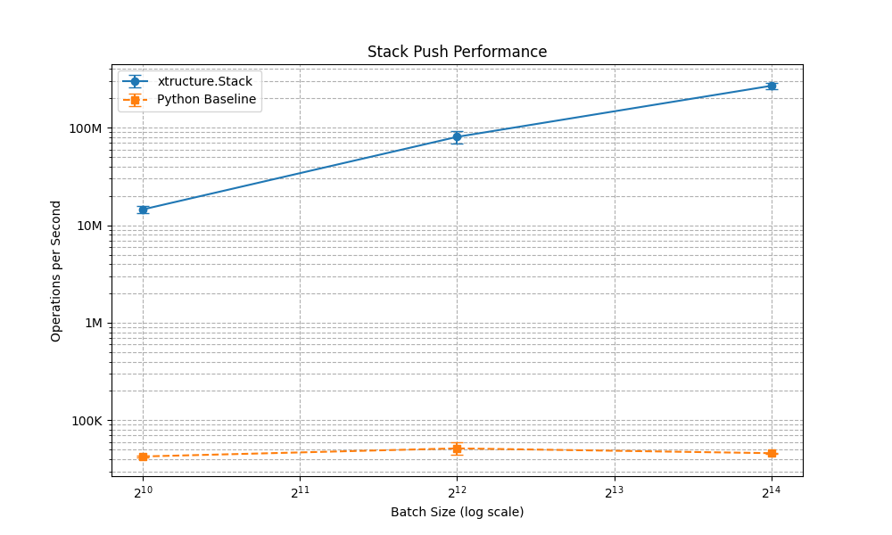
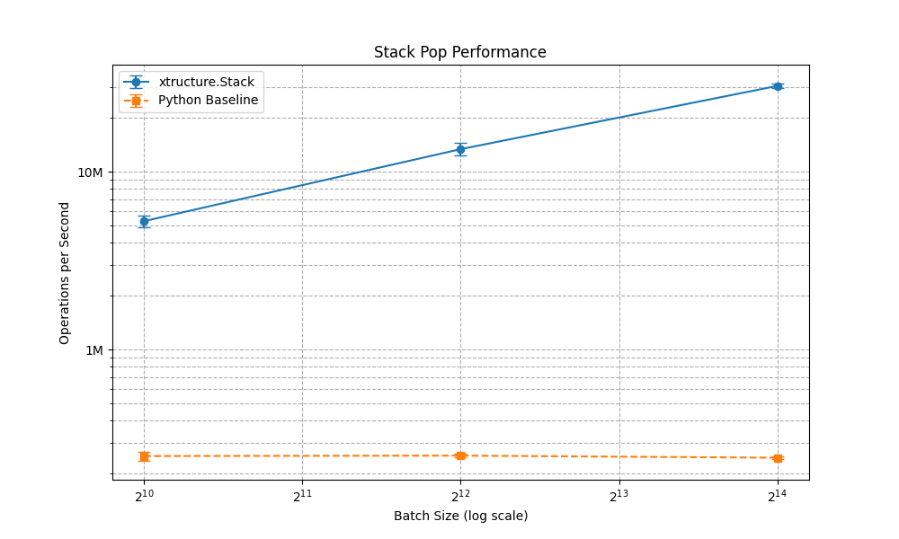
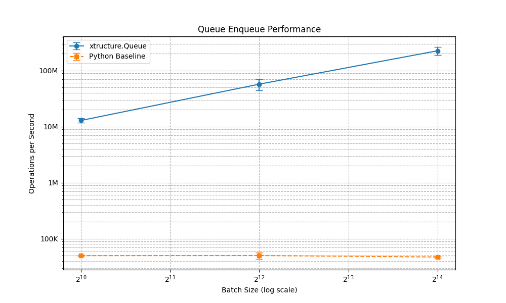
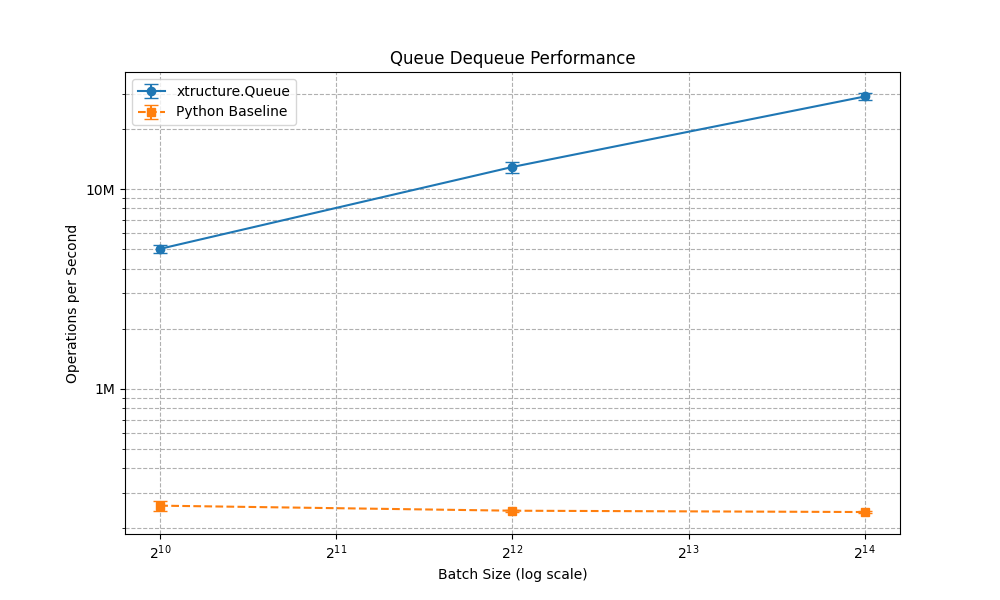
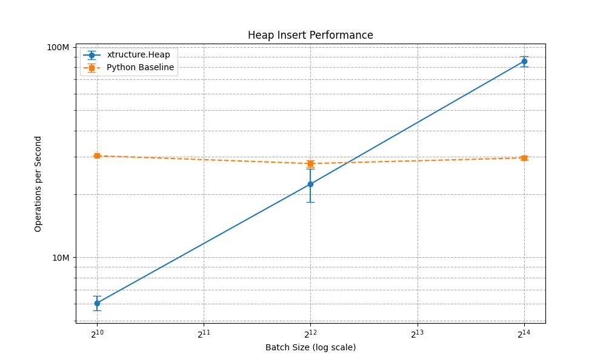
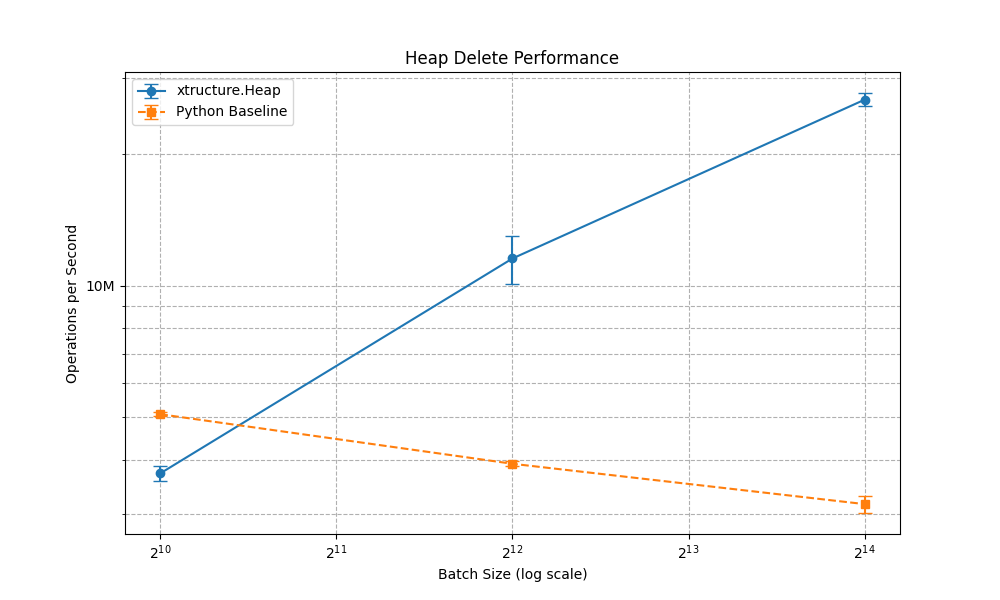
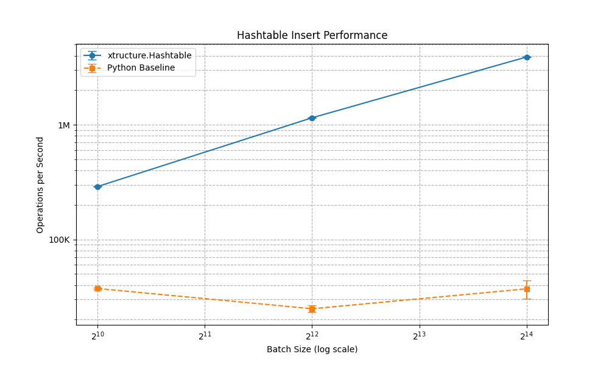
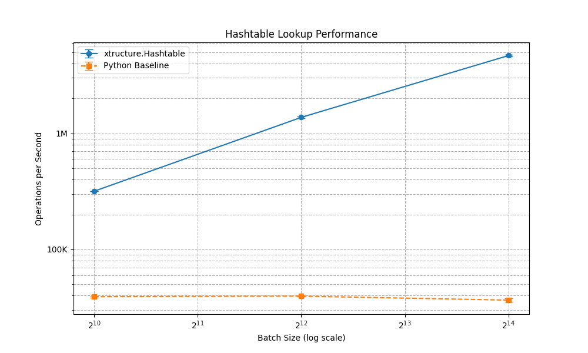

<div align="center">
  
</div>

# Xtructure

A Python package providing JAX-optimized data structures, including a batched priority queue and a cuckoo hash table.

## Features

- Stack (`Stack`): A LIFO (Last-In, First-Out) data structure.
- Queue (`Queue`): A FIFO (First-In, First-Out) data structure.
- Batched GPU Priority Queue (`BGPQ`): A batched priority queue optimized for GPU operations.
- Cuckoo Hash Table (`HashTable`): A cuckoo hash table optimized for GPU operations.
- Xtructure NumPy (`xtructure_numpy`): JAX-compatible operations for dataclass manipulation including concatenation, stacking, padding, conditional selection, deduplication, and element selection.
- Optimized for JAX.

## Structure Layout Flexibility

Xtructure stores every `@xtructure_dataclass` in **Structure of Arrays (SoA)**
form for JAX performance, yet exposes **Array of Structures (AoS)** semantics to
callers. See [Structure Layout Flexibility](https://tinker495.github.io/Xtructure/layout_flexibility.html) for the
full rationale, breakdown of supporting utilities, and a worked example.

## Installation

```bash
pip install xtructure
pip install git+https://github.com/tinker495/xtructure.git # recommended
```

Currently under active development, with frequent updates and potential bug fixes. For the most up-to-date version, it is recommended to install directly from the Git repository.

## Documentation

Detailed documentation on how to use Xtructure is available at [https://tinker495.github.io/Xtructure/](https://tinker495.github.io/Xtructure/).

*   **[Core Concepts](https://tinker495.github.io/Xtructure/core_concepts.html)**: Learn how to define custom data structures using `@xtructure_dataclass` and `FieldDescriptor`.
*   **[Stack Usage](https://tinker495.github.io/Xtructure/stack.html)**: Guide to using the Stack data structure.
*   **[Queue Usage](https://tinker495.github.io/Xtructure/queue.html)**: Guide to using the Queue data structure.
*   **[BGPQ Usage](https://tinker495.github.io/Xtructure/bgpq.html)**: Guide to using the Batched GPU Priority Queue.
*   **[HashTable Usage](https://tinker495.github.io/Xtructure/hashtable.html)**: Guide to using the Cuckoo hash table.
*   **[Xtructure NumPy Operations](https://tinker495.github.io/Xtructure/xnp.html)**: Guide to using `xtructure_numpy` (`xnp`) operations for dataclass manipulation.
*   **[Structure Layout Flexibility](https://tinker495.github.io/Xtructure/layout_flexibility.html)**: How SoA storage and AoS semantics coexist in Xtructure.

Quick examples can still be found below for a brief overview.

## Quick Examples

```python
import jax
import jax.numpy as jnp

from xtructure import xtructure_dataclass, FieldDescriptor
from xtructure import HashTable, BGPQ
from xtructure import numpy as xnp  # Recommended import method


# Define a custom data structure using xtructure_dataclass
@xtructure_dataclass
class MyDataValue:
    a: FieldDescriptor.scalar(dtype=jnp.uint8)
    b: FieldDescriptor.tensor(dtype=jnp.uint32, shape=(1, 2))


# --- HashTable Example ---
print("--- HashTable Example ---")

# Build a HashTable for a custom data structure
key = jax.random.PRNGKey(0)
key, subkey = jax.random.split(key)
hash_table: HashTable = HashTable.build(MyDataValue, 1, capacity=1000)

# Insert random data
items_to_insert = MyDataValue.random((100,), key=subkey)
hash_table, inserted_mask, _, _ = hash_table.parallel_insert(items_to_insert)
print(f"HashTable: Inserted {jnp.sum(inserted_mask)} items. Current size: {hash_table.size}")

# Lookup an item
item_to_find = items_to_insert[0]
_, found = hash_table.lookup(item_to_find)
print(f"HashTable: Item found? {found}")

# Parallel lookup for multiple items
items_to_lookup = items_to_insert[:5]
idxs, founds = hash_table.lookup_parallel(items_to_lookup)
print(f"HashTable: Found {jnp.sum(founds)} out of {len(items_to_lookup)} items in parallel lookup.")


# --- Batched GPU Priority Queue (BGPQ) Example ---
print("\n--- BGPQ Example ---")

# Build a BGPQ with a specific batch size
key = jax.random.PRNGKey(1)
pq_batch_size = 64
priority_queue = BGPQ.build(
    2000,
    pq_batch_size,
    MyDataValue,
)
print(f"BGPQ: Built with max_size={priority_queue.max_size}, batch_size={priority_queue.batch_size}")

# Prepare a batch of keys and values to insert
key, subkey1, subkey2 = jax.random.split(key, 3)
keys_to_insert = jax.random.uniform(subkey1, (pq_batch_size,)).astype(jnp.float16)
values_to_insert = MyDataValue.random((pq_batch_size,), key=subkey2)

# Insert data
priority_queue = BGPQ.insert(priority_queue, keys_to_insert, values_to_insert)
print(f"BGPQ: Inserted a batch. Current size: {priority_queue.size}")

# Delete a batch of minimums
priority_queue, min_keys, _ = BGPQ.delete_mins(priority_queue)
valid_mask = jnp.isfinite(min_keys)
print(f"BGPQ: Deleted {jnp.sum(valid_mask)} items. Size after deletion: {priority_queue.size}")


# --- Xtructure NumPy Operations Example ---
print("\n--- Xtructure NumPy Operations Example ---")

# Create some test data
data1 = MyDataValue.default((3,))
data1 = data1.replace(
    a=jnp.array([1, 2, 3], dtype=jnp.uint8), b=jnp.array([[[1.0, 2.0]], [[3.0, 4.0]], [[5.0, 6.0]]], dtype=jnp.uint32)
)

data2 = MyDataValue.default((2,))
data2 = data2.replace(
    a=jnp.array([4, 5], dtype=jnp.uint8), b=jnp.array([[[7.0, 8.0]], [[9.0, 10.0]]], dtype=jnp.uint32)
)

# Concatenate dataclasses
concatenated = xnp.concat([data1, data2])
print(f"XNP: Concatenated shape: {concatenated.shape.batch}")

# Stack dataclasses (requires same batch shape)
data3 = MyDataValue.default((3,))
data3 = data3.replace(
    a=jnp.array([6, 7, 8], dtype=jnp.uint8),
    b=jnp.array([[[11.0, 12.0]], [[13.0, 14.0]], [[15.0, 16.0]]], dtype=jnp.uint32),
)
stacked = xnp.stack([data1, data3])
print(f"XNP: Stacked shape: {stacked.shape.batch}")

# Conditional operations
condition = jnp.array([True, False, True])
filtered = xnp.where(condition, data1, -1)
print(f"XNP: Conditional filtering: {filtered.a}")

# Unique filtering
mask = xnp.unique_mask(data1)
print(f"XNP: Unique mask: {mask}")

# Take specific elements
taken = xnp.take(data1, jnp.array([0, 2]))
print(f"XNP: Taken elements: {taken.a}")

# Update values conditionally
indices = jnp.array([0, 1])
condition = jnp.array([True, False])
new_values = MyDataValue.default((2,))
new_values = new_values.replace(
    a=jnp.array([99, 100], dtype=jnp.uint8), b=jnp.array([[[99.0, 99.0]], [[100.0, 100.0]]], dtype=jnp.uint32)
)
updated = xnp.update_on_condition(data1, indices, condition, new_values)
print(f"XNP: Updated elements: {updated.a}")
```

## Working Example

For a fully functional example using `Xtructure`, check out the [JAxtar](https://github.com/tinker495/JAxtar) repository. `JAxtar` demonstrates how to use `Xtructure` to build a JAX-native, parallelizable A* and Q* solver for neural heuristic search research, showcasing the library in a real, high-performance computing workflow.

## Benchmark Results

Measured on NVIDIA GeForce RTX 5090.

Raw JSON links are in the last column; plots show ops/sec by batch size.

| Structure | Op A (plot) | Op B (plot) | Results |
| --- | --- | --- | --- |
| Stack |  |  | [`stack_results.json`](./xtructure_benchmarks/benchmark_data/stack_results.json) |
| Queue |  |  | [`queue_results.json`](./xtructure_benchmarks/benchmark_data/queue_results.json) |
| BGPQ (Heap) |  |  | [`heap_results.json`](./xtructure_benchmarks/benchmark_data/heap_results.json) |
| Hash Table |  |  | [`hashtable_results.json`](./xtructure_benchmarks/benchmark_data/hashtable_results.json) |

### Detailed Results (median ops/sec ± IQR; speedup = xtructure/python)

Values are shown in the order 1,024 / 4,096 / 16,384. Units abbreviated: K=1e3, M=1e6.

| Structure | Operation | xtructure (median ± IQR) | python (median ± IQR) | Speedup (×) |
| --- | --- | --- | --- | --- |
| Stack | Push | 14.54M ± 2.64M<br/>80.67M ± 24.31M<br/>269.43M ± 37.55M | 42.56K ± 1.91K<br/>51.53K ± 15.00K<br/>46.00K ± 1.31K | x 341.64<br/>x 1,566.09<br/>x 5,859.23 |
| Stack | Pop | 5.27M ± 0.79M<br/>13.38M ± 2.14M<br/>30.33M ± 1.87M | 251.70K ± 30.27K<br/>253.13K ± 11.31K<br/>246.30K ± 10.52K | x 20.93<br/>x 52.85<br/>x 123.17 |
| Queue | Enqueue | 12.87M ± 2.24M<br/>57.15M ± 25.25M<br/>225.20M ± 76.03M | 49.92K ± 1.39K<br/>50.11K ± 13.59K<br/>47.15K ± 3.06K | x 257.83<br/>x 1,140.49<br/>x 4,777.20 |
| Queue | Dequeue | 5.02M ± 0.48M<br/>12.91M ± 1.67M<br/>29.11M ± 2.38M | 259.49K ± 28.88K<br/>244.84K ± 4.63K<br/>241.12K ± 5.37K | x 19.36<br/>x 52.77<br/>x 120.74 |
| BGPQ (Heap) | Insert | 6.06M ± 0.94M<br/>22.30M ± 8.14M<br/>85.58M ± 9.52M | 30.38M ± 0.36M<br/>27.90M ± 2.07M<br/>29.66M ± 1.10M | x 0.20<br/>x 0.80<br/>x 2.89 |
| BGPQ (Heap) | Delete | 3.72M ± 0.28M<br/>11.56M ± 2.90M<br/>26.71M ± 1.90M | 5.08M ± 0.10M<br/>3.91M ± 0.10M<br/>3.16M ± 0.29M | x 0.73<br/>x 2.95<br/>x 8.44 |
| Hash Table | Insert | 289.29K ± 1.77K<br/>1.15M ± 19.00K<br/>3.91M ± 60.75K | 37.30K ± 1.33K<br/>24.82K ± 3.21K<br/>37.06K ± 13.53K | x 7.76<br/>x 46.43<br/>x 105.49 |
| Hash Table | Lookup | 317.28K ± 2.88K<br/>1.37M ± 54.82K<br/>4.67M ± 161.00K | 39.22K ± 1.53K<br/>39.61K ± 0.44K<br/>36.59K ± 2.42K | x 8.09<br/>x 34.67<br/>x 127.67 |

## Citation

If you use this code in your research, please cite:

```
@software{kyuseokjung2025xtructure,
    title={xtructure: JAX-optimized Data Structures},
    author={Kyuseok Jung},
    url = {https://github.com/tinker495/Xtructure},
    year={2025},
}
```
